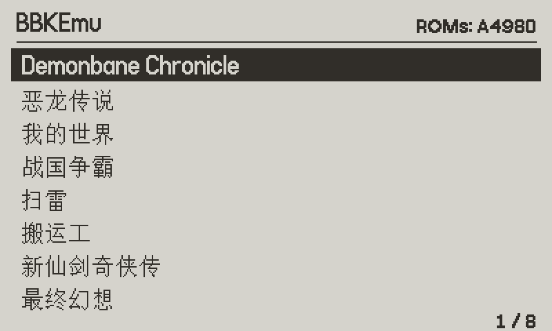
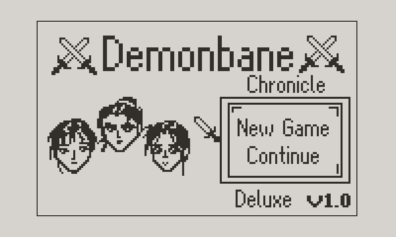
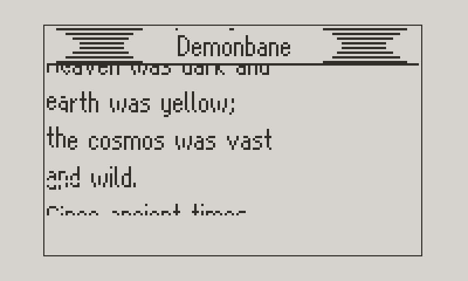
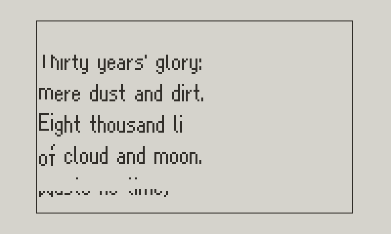
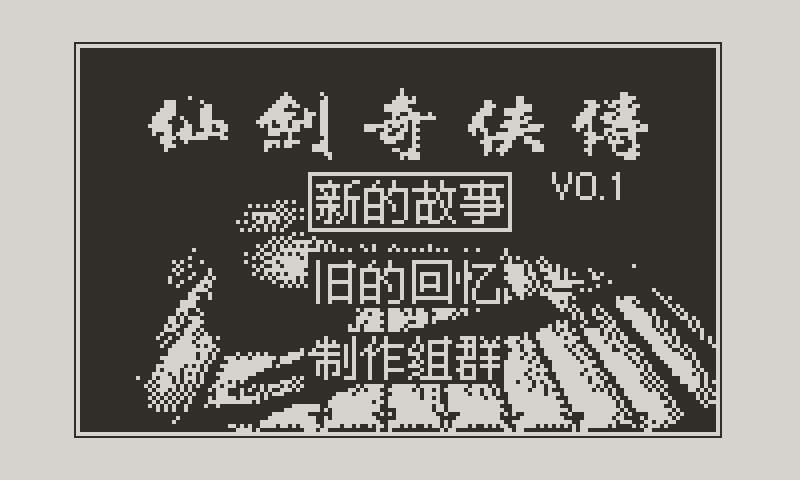
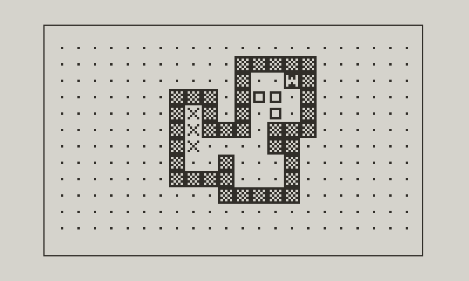

# BBKEmu for Playdate

> **Made with AI.** This port was written by an AI: Anthropic's Claude (Claude Code, running
> Claude Opus 5.5), working with and directed by gopherbone, who tested it on a real Playdate.
> That covers the code, tests, build setup, screenshots and this README. Claude also drove the
> device over USB to install builds, run benchmarks and read its profiler. Commits it made
> carry a `Co-Authored-By: Claude` trailer. Sources are credited [below](#sources-and-credits).

Play BBK (步步高) A4980/A4988 electronic-dictionary games on a [Playdate](https://play.date).
It runs [BBKEmu](https://github.com/AloysHF/BBKEmu)'s emulator core (pulled in unmodified as
the `upstream/` submodule, then patched at build time to run without the Rust standard library)
behind a small C frontend.

It comes ready to play. The release bundles the A4980 system ROMs and two English fan
translations: **Demonbane Chronicle v0.3** (伏魔记) and **Heroes of Jin Yong v0.2**
(金庸群侠传).

| | |
|---|---|
|  |  |
|  |  |
|  |  |

- The 159×96 LCD is drawn at 2× in portrait, or rotated at 1.5× for landscape games, with
  optional LCD ghosting shown by dithering.
- Game list with Chinese titles, drawn with the dictionary's own font from `8.BIN`.
- Battery saves are written automatically; 3 save-state slots per game.
- An on-screen keypad (crank or D-pad) for every BBK key.

## Install

Download `BBKEmu.pdx.zip` from the [latest release](../../releases/latest) and either sideload it at
[play.date/account/sideload](https://play.date/account/sideload/), or unzip it into the `Games`
folder of the Playdate's data disk.

Both translations are in the game list straight away. To add more games, run BBKEmu once so it
creates its folders, then reboot the Playdate to its data disk (Settings → System → Reboot to
Data Disk) and open the folder in `Data/` ending in `com.gopherbone.bbkemu` (sideloaded games
get a `user.` prefix):

| Put this | Here |
|---|---|
| More games | `Games/*.gam` |
| A4988 system ROMs, for games that need that model | `ROMs/A4988/8.BIN` and `E.BIN` |

Files in the Data folder take priority over the bundled ones, so you can also drop in your own
A4980 ROMs or newer builds of the translations (same file names). Saves go to `Saves/<game>.bbksav` and states to
`States/<game>/slotN.state`. This is the same layout and file format as the macOS BBKEmu
frontend's `~/Library/Application Support/BBKEmu`, so ROMs, saves and states can be copied
between them.

## Controls

| Playdate | BBK |
|---|---|
| D-pad | Arrow keys |
| Ⓐ | Enter |
| Ⓑ | Exit |
| Menu → **keypad** | Any key: move with the crank or D-pad, Ⓐ presses it |
| Menu → **options** | Save/load state, state slot, portrait/landscape, ghosting, model, performance overlay, reset |
| Menu → **game list** | Back to the list (saves first) |

For landscape games, hold the Playdate with the crank on top; the D-pad turns with it.

Each game is set to the A4980 by default (or whichever model has ROMs installed); switch it in
options if a game needs the A4988.

## Performance

Full speed. The dictionaries ran a 6502 at 4 MHz, about 21,000 instructions per 60 Hz frame.
On a Rev B Playdate, emulating a frame of Demonbane's title screen now takes about 14 ms against
a budget of 16.7 ms. The unmodified core took about 194 ms.

The Playdate's main memory is slow external PSRAM: a cache miss costs about 0.9 µs and every
store to a new cache line about 0.56 µs. The game task's stack is in fast tightly-coupled memory,
but there is only about 8 KB of it. So the speedups are mostly about touching slow memory less:

- **A fast path for the documented 6502 opcodes** (`tools/gen_fast6502.py`) instead of
  mos6502's generic decoder: dedicated code for the 17 opcodes that are ~80% of what games
  execute, then a compact table-driven path. Everything else still runs through mos6502.
- **One tight inner loop** (`fast6502::run`) that keeps CPU registers, cycle counts and timer
  state in locals for the whole frame, returning only for interrupts, BRK and fallbacks.
- **A per-bank page cache**: a memory access is a compare and a load. Opcode and operands come
  through one lookup.
- **Rendering only rows that changed**, skipping the dither once ghosting has settled.
- **Battery autosave that only diffs flash when it has been written.**
- **`opt-level = "s"`.** Smaller code measured faster than `-O3`.

`make check` compares all of these against the original code: memory accesses exhaustively,
every opcode from thousands of random states, and whole games in lockstep against the original
loop running on mos6502. Turn on **Show performance** in options to see the frame cost on your
device. Its `bench` figure averages emulated frames 300 to 599, so builds can be compared on
identical work.

### Fix to upstream behaviour

After about a minute without input the dictionary OS arms its real-time-clock alarm for auto
power-off. In the upstream core nothing acknowledges that interrupt, so it fires after every
instruction and the game locks up and crawls. Acknowledging it lets the OS power off, which
hangs the emulator. This port doesn't raise the alarm interrupt at all, so games can idle
indefinitely. The macOS frontend uses the unpatched core and is affected too.

## Building

Requires the [Playdate SDK](https://play.date/dev/), Rust stable with the
`thumbv7em-none-eabihf` target, and Arm's GNU toolchain (Homebrew's `arm-none-eabi-gcc` lacks
the C library):

```sh
git clone --recursive git@github.com:gopherbone/bbk_playdate.git
cd bbk_playdate
rustup target add thumbv7em-none-eabihf
brew install --cask gcc-arm-embedded   # Linux: apt install gcc-arm-none-eabi libnewlib-arm-none-eabi

make            # BBKEmu.pdx for the device and the Simulator
make run        # open it in the Playdate Simulator
make install    # copy it to a USB-connected, unlocked Playdate and launch it
```

Set `ARM_TOOLCHAIN=/path/to/bin` if the Arm toolchain isn't under `/Applications/ArmGNUToolchain`.

### Layout

- `patches/bbkemu-core-nostd.patch`: makes upstream `bbkemu-core` build without `std`: `alloc`
  collections, a small error type in place of `anyhow`, and a hand-written save-state codec that
  writes the same bytes as upstream's `bincode` one. The Makefile applies it to a copy in `gen/`.
- `rust/`: C ABI over the core as a static library: allocator on the Playdate heap, 1-bit
  renderer with dithered ghosting, battery saves and save states.
- `src/main.c`: the frontend: game list, emulation loop, keypad, options.
- `src/gb2312_table.h`: Unicode → GB2312 glyph lookup, generated by `tools/gen_gb2312.py`.
- `Source/`: copied into the `.pdx` by `pdc`: the bundled ROMs (`ROMs/A4980/`) and games
  (`Bundled/`; a separate folder because the Data folder's `Games/` hides the pdx's own).
- `docs/`: screenshots, rendered from the emulator's frame buffer.

## Sources and credits

- [BBKEmu](https://github.com/AloysHF/BBKEmu) by Aloys (AloysHF): the emulator core, used via
  the `upstream/` submodule and patched at build time (GPL-3.0-or-later).
- [mos6502](https://crates.io/crates/mos6502): the 6502 core upstream uses, still used here for
  everything outside the fast path and as the reference in `make check`.
- [Playdate SDK](https://play.date/dev/) and *Inside Playdate with C* by Panic: the C API, build
  rules and system fonts.
- [crank](https://github.com/pd-rs/crank): the Rust compiler flags for Playdate device builds.
- [Arm GNU Toolchain](https://developer.arm.com/downloads/-/arm-gnu-toolchain-downloads): device
  builds.
- Optimization ideas, especially that cache size and slow memory dominate on Playdate:
  [Dirty Optimization Secrets (C for Playdate)](https://devforum.play.date/t/dirty-optimization-secrets-c-for-playdate/23011)
  on the Playdate developer forum, and the CrankBoy developers'
  [interview](https://www.readonlymemo.com/playdate-crankboy-emulator-interview).
- Bundled: BBK A4980 system ROMs, 伏魔记 and 金庸群侠传 (BBK), with gopherbone's English
  translations Demonbane Chronicle v0.3 and Heroes of Jin Yong v0.2. Game titles are drawn
  with the 16×16 GB2312 font from the bundled `8.BIN`; the lookup table is generated with
  Python's `gb2312` codec.

## License

The code is GPL-3.0-or-later, the same as BBKEmu; see [LICENSE](LICENSE). The bundled BBK system
ROMs, 伏魔记 and 金庸群侠传 belong to BBK and are included as abandonware; Demonbane Chronicle
and Heroes of Jin Yong are fan translations.
